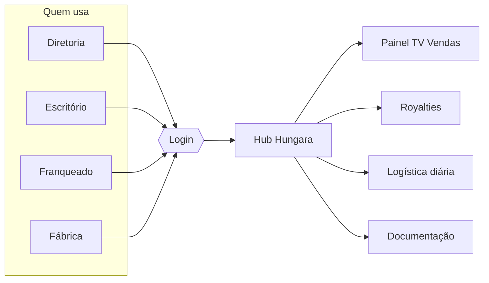

# Hub Hungara — Visão geral

## O problema

A Hungara cresceu de uma lanchonete em Niterói para uma rede com mais de 45 lojas. Junto vieram
planilhas, painéis, relatórios e ferramentas espalhadas: o painel de TV das vendas, análises de
royalties, logística diária, checklists da Yungas. Cada coisa em um lugar, cada uma com um acesso
diferente, e sem controle de quem pode ver o quê.

## O que o Hub é

O **Hub Hungara** é a porta de entrada única para tudo isso. A pessoa entra com e-mail e senha,
e vê **só as implementações liberadas para o perfil dela**.

## Três tipos de implementação

| Tipo | O que é | Exemplo |
|---|---|---|
| **Página interna** | Tela feita dentro do próprio Hub, com código no repositório | Módulo de boas-vindas, relatório de royalties |
| **Link externo** | Abre outro site em nova aba | Painel de TV das lojas, Yungas |
| **Embutido** | Mostra outro site dentro do Hub, em um quadro | Planilha do Google publicada, Looker Studio |

## Perfis

| Perfil | Quem | O que vê |
|---|---|---|
| Administrador | TI e estagiário de processos | Tudo, e gerencia usuários e implementações |
| Diretoria | Dono e CEO | Todas as implementações ativas |
| Escritório | Equipe administrativa | O que for liberado para o escritório |
| Franqueado | Donos de franquia | O que for liberado para franqueados |
| Fábrica / Logística | Equipe da fábrica | O que for liberado para a fábrica |

Além do perfil, o admin pode abrir exceção para uma pessoa específica (liberar ou bloquear).

## O que o Hub NÃO é

- Não substitui o PDV Legal, a Yungas ou o Sischef. Ele organiza o acesso ao que já existe e ao que vamos criar.
- Não manda e-mail (por enquanto). Senhas são passadas pelo admin, fora do sistema.
