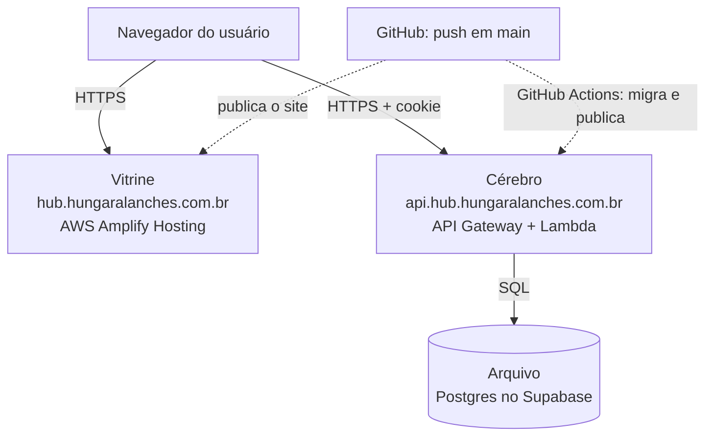
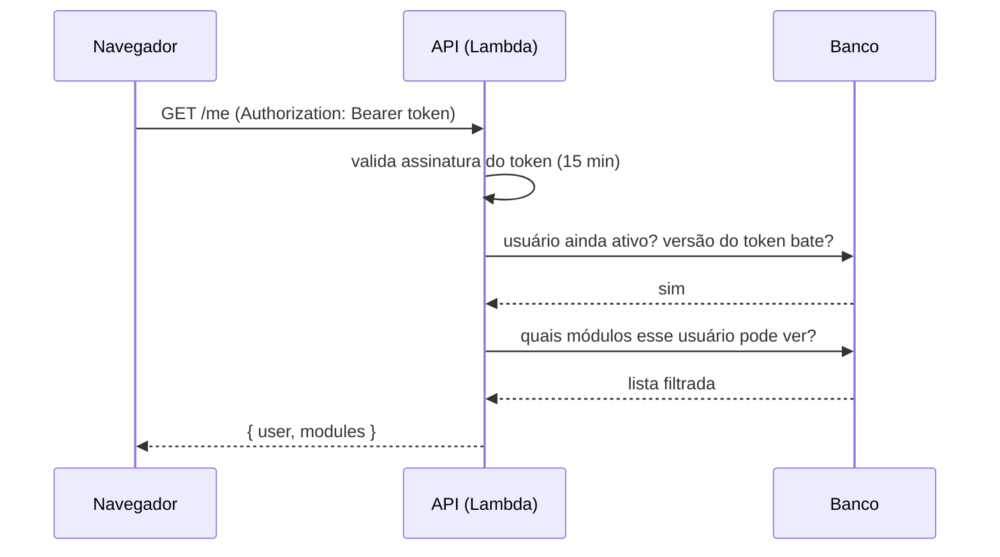

# Hub Hungara — Arquitetura

## As três peças



| Peça | Tecnologia | Papel |
|---|---|---|
| **Vitrine** (frontend) | React + Vite + Tailwind, hospedado no AWS Amplify | O que a pessoa vê: login, catálogo, telas de admin, módulos internos |
| **Cérebro** (API) | Uma função AWS Lambda com o framework Hono (TypeScript), atrás do API Gateway | Confere quem é a pessoa, o que ela pode ver, grava usuários e módulos |
| **Arquivo** (banco) | Postgres gerenciado pelo Supabase (plano gratuito) | Guarda usuários, sessões, módulos, permissões e auditoria |

O banco **só** é acessado pela Lambda. O frontend nunca fala com o Supabase. Isso significa que
trocar de fornecedor de banco no futuro é um `pg_dump` / `pg_restore` e uma variável de ambiente.

## Estrutura do repositório

```
hub-hungara/
├── apps/web/        Vitrine (React). Módulos internos em src/modules/
├── apps/api/        Cérebro (Lambda Hono). Rotas em src/routes/, banco em src/db/
├── packages/shared/ Validações e tipos usados pelos dois lados (zod)
├── infra/bootstrap/ Criação única da role de deploy (OIDC) e do budget
├── docs/            Esta documentação
└── .github/workflows/  CI e deploy automático
```

## Fluxo de uma requisição



## Custo estimado

| Item | Custo/mês |
|---|---|
| Amplify Hosting | ~US$ 0 a 1 (tráfego interno pequeno) |
| Lambda + API Gateway | ~US$ 0 (dentro do nível gratuito) |
| CloudWatch (logs e alarme) | < US$ 0,50 |
| Supabase (Postgres) | US$ 0 (plano free) |
| **Total** | **menos de US$ 2/mês** |

O que mudaria se a rede dobrasse de tamanho: nada relevante. Lambda e Amplify escalam sozinhos.
O primeiro limite prático é o Supabase free (500 MB de banco), muito acima do necessário.
