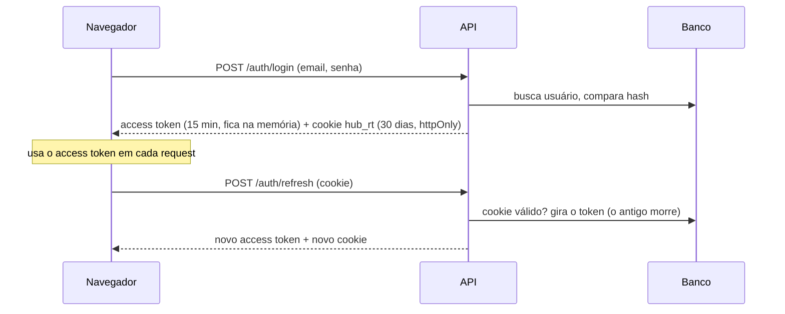
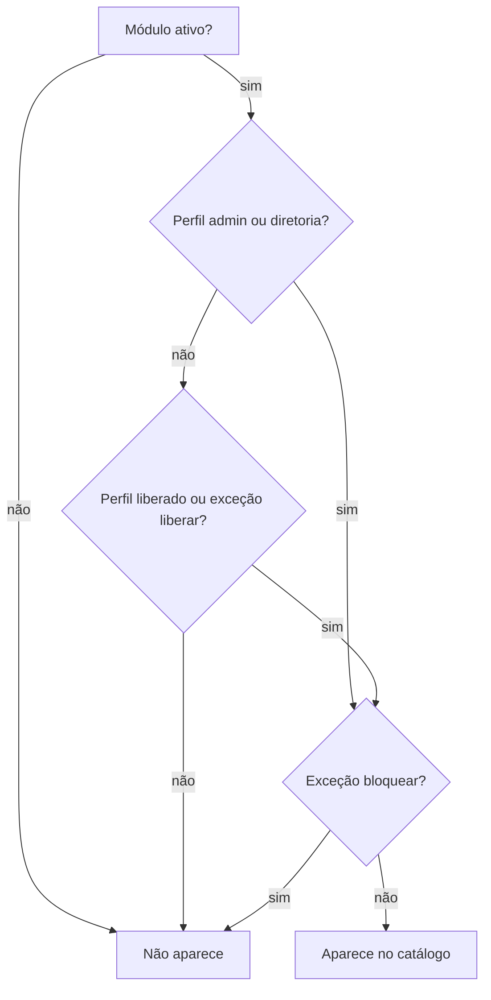

# Hub Hungara — Login e permissões

## Senhas

- O **admin cria o usuário** com uma senha temporária e passa fora do sistema (WhatsApp, pessoalmente).
- No **primeiro login** o Hub obriga a trocar por uma senha só da pessoa (mínimo 8 caracteres).
- **Esqueceu?** Fala com o admin, que redefine. Não existe e-mail de recuperação por enquanto.
- Senhas são guardadas como **hash bcrypt**. Ninguém, nem o admin, consegue ler a senha de alguém.
- 10 erros seguidos travam a conta por 15 minutos.

## Como o login funciona por dentro

- **Access token**: JWT assinado, vale 15 minutos, fica só na memória do navegador.
- **Refresh token**: aleatório, guardado como hash no banco, vale 30 dias, viaja num cookie
  `HttpOnly` que o JavaScript não lê. A cada uso ele é trocado; se alguém tentar reusar um antigo,
  todas as sessões daquela cadeia caem.
- **Desativou um usuário ou trocou o perfil?** Vale na hora: a API confere no banco a cada request.

## Quem vê o quê

A regra em uma frase:

> Módulo **ativo** **e** (perfil é admin/diretoria **ou** perfil está liberado **ou** a pessoa tem exceção "liberar") **e** a pessoa **não** tem exceção "bloquear".

A mesma regra vale para o catálogo e para qualquer rota de dados de um módulo interno
(`requireModule(slug)` na API). Não existe "esconder o card mas deixar a rota aberta".

## Auditoria

Tudo que importa fica registrado: login (ok e falho), bloqueio, troca de senha, criação e
alteração de usuário, criação e alteração de módulo. Admin vê em **Auditoria**.
