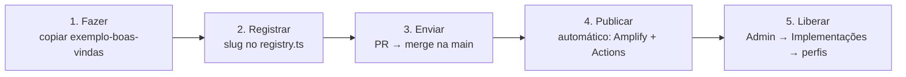

# Hub Hungara — Como subir uma implementação nova

> Este é o guia do dia a dia. Se só vai ler um arquivo, leia este.

A regra de ouro: **o cadastro (título, ícone, quem vê) fica no banco, feito pelo Admin. O código
fica no repositório. O `slug` é a cola entre os dois.**



## Caso A: página interna (código React)

1. Rode o projeto local: `npm run dev` na raiz (API em :3000, site em :5173).
2. Copie a pasta `apps/web/src/modules/exemplo-boas-vindas` para `apps/web/src/modules/<slug>`.
   O slug é o nome da implementação em minúsculas com hífens, ex.: `royalties-mensais`.
3. Edite `index.tsx`. O componente recebe `me` (quem está logado) e `module` (o cadastro).
4. Registre em `apps/web/src/modules/registry.ts`:
   ```ts
   "royalties-mensais": () => import("./royalties-mensais"),
   ```
5. Precisa de dados do servidor? Crie `apps/api/src/routes/<slug>.ts` protegido por
   `requireAuth, requirePasswordChanged, requireModule("<slug>")` e registre em `app.ts`.
   Assim só quem vê o módulo acessa os dados dele.
6. Teste local: Admin → Implementações → Nova → tipo "Página interna" → escolha o slug → marque perfis.
   Abra `/m/<slug>`.
7. Abra um Pull Request. O CI roda typecheck, lint e testes. Quando entrar em `main`:
   - o **Amplify** publica o site sozinho (~3 min);
   - se mexeu em `apps/api`, o **GitHub Actions** migra o banco e publica a Lambda.
8. Em produção, repita o passo 6 no Admin de produção. O card aparece na hora para os perfis marcados.

## Caso B: link externo

Só o Admin: Implementações → Nova → tipo "Link externo" → URL → perfis. Zero deploy.
Exemplo: o Painel TV das lojas (`https://painel-tv-lojas.hungaralanches.com.br`).

## Caso C: embutido (iframe)

Mesmo caminho do B com tipo "Embutido". Use o botão **Testar** antes de liberar: alguns sites
(Yungas, planilha não publicada) não permitem ser embutidos. Se der branco, troque para link.

## Checklist antes de liberar para a rede

- [ ] Título curto e descrição em uma frase (o card mostra até 3 linhas).
- [ ] Ícone e categoria coerentes com os cards vizinhos.
- [ ] Perfis corretos. Admin e Diretoria já veem tudo; marque só os demais.
- [ ] Testou logado como um usuário do perfil alvo (crie um usuário de teste).
- [ ] Se for dado sensível de loja, a rota da API usa `requireModule`.
